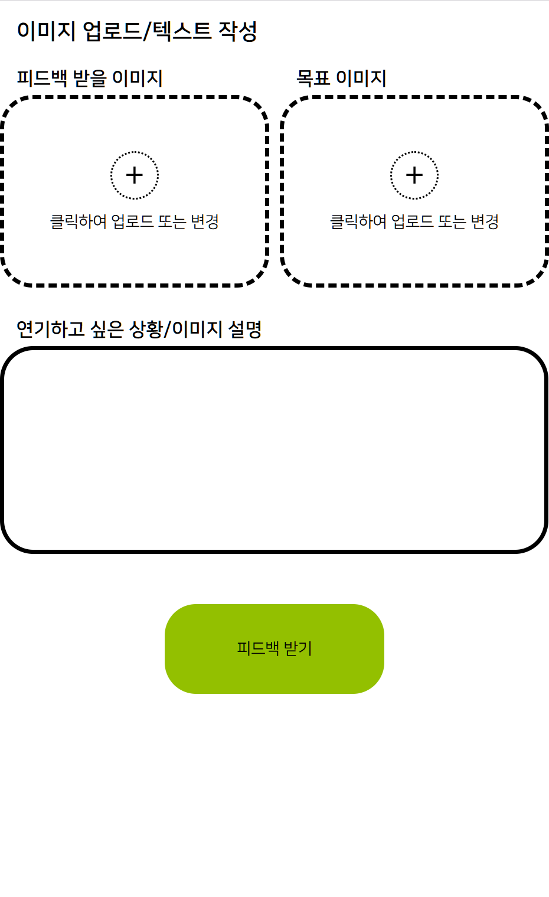

# 함께해줘서 고마워! Team 23!


# 표정연기 도우미 AI #


> LG AI 청소년 캠프의 경제적 지원과 지도 아래 제작되었습니다.

> 이 프로젝트에는 `GNU General Public License(GPL) v3.0` 이 적용되어 있습니다.<br>
> 이 라이선스에 관한 자세한 내용은 `LICENSE` 파일을 참고하시기 바랍니다.

> 이 프로젝트에 사용된 `SigLIP`, `Mediapipe Face Landmark` 모델은 `Apache License 2.0`을 따르고 있습니다.<br><br>
> 사용된 모델의 라이선스(`Apache License 2.0`)와 이 프로젝트의 라이선스(`GNU General Public License(GPL) v3.0`)는 **호환 됨**을 밝힙니다.<br><br>
> [이 페이지](https://ai.google.dev/edge/mediapipe/solutions/vision/face_landmarker/python?hl=ko)에서 `Mediapipe Face Landmark` 모델 파일을 다운로드 받았으며, `/models/LICENSE (Mediapipe Face Landmarker)`에서 `Apache License 2.0` 라이선스 전문을 확인하실 수 있습니다.


> 프로젝트 관련 문의는 <rlaalscks130710@gmail.com>으로 부탁드립니다.

-------

## 목차(Index)
0. [상태](#상태-status) ([Status](#상태-status))
1. [이 프로젝트는...](#이-프로젝트는) ([This project is...](#this-project-is))<br>
    1.1. [사용법](#사용법) ([Usage](#usage))<br>
    1.2. [시스템 구조](#시스템-구조) ([System Architecture](#system-architecture))<br>
2. [디렉토리 구조](#디렉토리-구조) ([Folder Structure](#folder-structure))
3. [사용 모델 및 라이브러리 / 폰트](#사용-모델라이브러리-및-폰트) ([Models / Libraries / Fonts](#models--libraries--fonts))
4. [실행 가이드](#실행-가이드)
4. [크레딧](#크레딧) ([Credits](#credits))

-------

## 상태 (Status)

- 개발: 개발 완료(Develop: Complate)


- 서비스: 서비스 미제공 (Service: Unavailable)


- 업데이트 제공: 업데이트 지원 중단 (Update: Unsupported)


-------

## 이 프로젝트는...
이 프로젝트는 표정 연기를 도와주기 위해 만들어진 프로젝트입니다.

### 사용법

시작화면에서 `Start!!` 버튼을 클릭하면 아래와 같은 화면을 볼 수 있을 것 입니다.<br><br>


여기에서 **어떤 입력란**에 입력하거나 입력하지 않느냐에 따라 _**피드백 모드가 바뀝니다**_.<br>
피드백 모드는 총 두가지(`이미지 모드`, `텍스트 모드`)가 있습니다.<br>

이미지 모드는 `피드백 받을 이미지`와 `목표 이미지`를 입력하면 사용 할 수 있으며, _**목표 이미지**를 따라 할 수 있도록_ AI가 피드백 해줍니다.<br>
(`연기하고 싶은 상황/이미지 설명`은 필수는 아니지만, 입력 할 경우 AI가 참고해서 피드백 해줍니다.)<br>

텍스트 모드는 `피드백 받을 이미지`와 `연기하고 싶은 상황/이미지 설명`을 입력하면 사용 할 수 있으며, _**연기하고 싶은 상황**에 맞는 표정을 따라 할 수 있도록_ AI가 피드백 해줍니다.<br>
(`목표 이미지`를 입력 할 경우 이미지 모드로 인식되니 주의하시기 바랍니다.)<br>

### 시스템 구조
시스템 구조는 아래와 같습니다.

1. 사용자의 입력 값을 기반으로 피드백 모드 정하기<br>
(피드백 모드를 정하는 기준은 [사용법](#사용법)에 적혀있습니다.)
2. 클라이언트에서 서버로 피드백 모드에 맞춰 입력 데이터 전송하기
3. 서버에서 이미지 분석하기
4. 분석된 이미지를 바탕으로 피드백 추출하기
5. 서버에서 클라이언트로 추출한 피드백 전송하기
6. 클라이언트에서 받은 피드백 보여주기

이미지 분석은 SigLIP과 MediaPipe Face Landmarker를 사용하며, 피드백 추출은 GPT-5.1을 사용합니다.<br>
(자세한 내용은 아래에 나오는 [사용 모델/라이브러리 및 폰트](#사용-모델라이브러리-및-폰트) 문단을 참고 하시기 바랍니다.)

## 디렉토리 구조

```
 Project
 ┣ 📂models
 ┃  ┣ face_landmarker.task
 ┃  ┗ LICENSE (Mediapipe Face Landmarker)
 ┣ 📂readmeSource
 ┃  ┗ 사용법_업로드화면_이미지KR.png
 ┣ 📂src
 ┃  ┣ 📂templates
 ┃  ┃  ┗ index.html
 ┃  ┣ app.py
 ┃  ┗ uploadDatas.json
 ┣ .gitignore
 ┣ LICENSE
 ┗ README.md
```

소스코드는 `/src/`에 있으며, `/models/`에 `사용한 모델 파일`과 `그 모델 파일의 라이선스 전문이 적힌 파일`이 있습니다.

프론트엔드에서 받은 이미지는 실행 후 생겨나는 `/src/upload/` 폴더에 저장됩니다.<br>

## 사용 모델/라이브러리 및 폰트

> 이 프로젝트에는 `SigLIP`, `Mediapipe Face Landmarker` 그리고 `GPT-5.1 API`를 사용했으며, `네이버`에서 제공한 `나눔글꼴(나눔스퀘어)`이 적용되어 있습니다.

`SigLIP`은 `transformers` 라이브러리를 통해 사용했으며,<br>
`Mediapipe Face Landmarker`는 [이 페이지](https://ai.google.dev/edge/mediapipe/solutions/vision/face_landmarker/python?hl=ko)에서 다운로드 받은 `face_landmarker.task` 파일과 `mediapipe` 라이브러리를 통해 사용했습니다.

프론트엔드에는 `네이버`에서 제공한 `나눔스퀘어` 글꼴이 적용되어 있습니다.

## 실행 가이드 - (미완성 - 나중에 다시 와주세요!)

> 아래 가이드는 `Windows 11` OS 기준으로 작성하였으며, `Python 3.11.9 Venv(가상환경)`이 설치 및 활성화 되어있다고 가정하고 작성하였습니다.

### 1. 환경 설정
1. Github에서 이 프로젝트 압축 파일을 다운로드 받고, <br>실행 할 폴더에 압축을 해제하세요.
2. 압축 해제 후, `/models/face_landmarker.task` 파일을 `/src/mp_mf/` 안에 복사하세요. (`mp_mf` 폴더는 직접 생성해야 합니다.)
3. `Powershell`을 키고, 프로젝트가 위치한 폴더로 이동한 후 아래 명령어를 실행하세요.
> ```powershell
> python -m pip install -r ./src/requirements.txt
> ```
4. `/src/`에 `.env` 파일을 생성하고, 아래 내용 중 사용 할 모델에 맞게 생성한 

> APIKey_GPT = 'API Key'     # OpenAI가 제작한 모델 사용 시<br><br>
> APIKey_Gemini = 'API Key'  # Google이 제작한 모델 사용 시

> **※경고※**<br>
> **_API 키가 저장된 파일은 외부에 공유하지 마십시오._**<br>
> **API 키가 유출되면 경제적 피해를 입을 수 있으며, 이 경고를 따르지 않거나 읽지 않아 생긴 피해는 책임지지 않습니다.**

5. `/src/app.py` 파일을 열고, 아래 변수를 설명에 따라 수정하세요. (필수 변수만 아래에 작성 해놓았습니다. 추가로 설정하려면 파이썬 파일 내부 주석을 참고 하십시오.)
> ```python
> PROJECT_DIR = ""  # app.py이 위치한 폴더 경로
> LLM_MODEL = ""  # Google이 만든 모델 사용시 "gemini", OpenAI가 만든 모델 사용시 "gpt"
> GEMINI_MODELNAME = ""  # Google이 만든 모델 사용시 모델이름 입력
> GPT_MODELNAME = ""  # OpenAI가 만든 모델 사용시 모델이름 입력
> ```

## 크레딧

이 프로젝트는 `LG AI 청소년 캠프 3기 23팀 팀원들`이 개발 및 기획했습니다.<br><br>
LG AI 청소년 캠프 3기 23팀 팀원들:
- 김도원 (SigLip, FaceLandmark, LLM 피드백 기능 구현)
- 김민찬 (풀스택 개발, 시스템 통합)
- 윤효령 (기획, SigLIP 라벨 제작)

특별히 감사드립니다:
- **강현욱 멘토님**
- 김회민 코디님
- 신영길 교수님
- 그 외 LG AI 청소년 캠프 3기 관계자 분들
- ChatGPT (By OpenAI, AI 어시스턴트)
- 그 외 사용된 LLM 서비스들